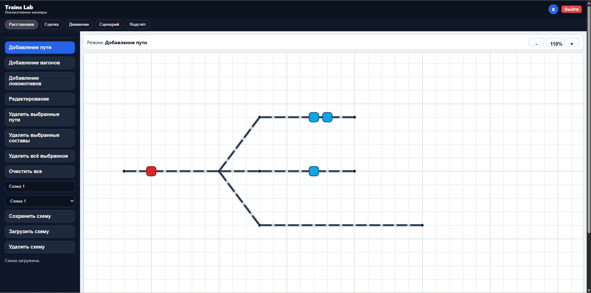
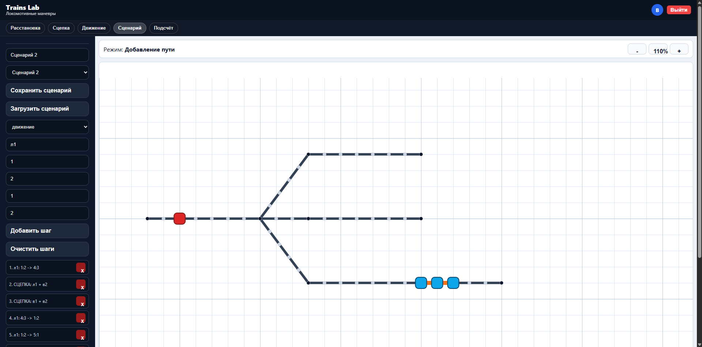

# Trains Lab

Веб-приложение для визуализации маневров локомотивов при формировании железнодорожных составов.

Система позволяет моделировать железнодорожные пути, размещать вагоны и локомотивы, сцеплять составы и планировать движение по рельсовой сети.

## Tech Stack

**Frontend**
- React
- Vite
- SVG canvas

**Backend**
- Go (net/http)
- JSON REST API

**Database**
- PostgreSQL

## Features

- визуальное построение железнодорожных путей
- размещение вагонов и локомотивов на рельсах
- сцепка и расцепка составов
- планирование движения локомотива
- проигрывание движения по таймлайну
- сценарии последовательных манёвров
- авторизация пользователей (JWT)

## Architecture

Frontend отображает рельсовую сеть и взаимодействует с backend через REST API.

Backend рассчитывает маршруты движения и возвращает timeline шагов, которые проигрываются в интерфейсе.

Движение рассчитывается по графу дискретных слотов рельсовой сети.

## Screenshots

### Editor

### Movement simulation

## Status

MVP prototype.
Проект находится на стадии разработки.